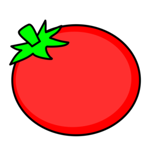
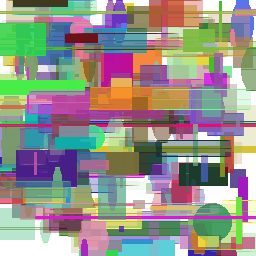
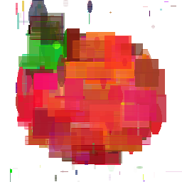

# Avatar Regenerator

Regenerate image using GA algorithm

## Example 01

Base Image:



Animated iterations:



20000th iteration:



## Example 02

Another example with 100k iterations, 300 chromosomes, 100 mutations rate


## Features

- [x] Basic GA
- [ ] Pre-compiled binaries
- [ ] Export to GIF
- [ ] Sampling for fitness function (Faster?)

## Usage

See `-h` for usage (Details would be update later :P)

```sh
avaregen --help
avaregen -h
```
